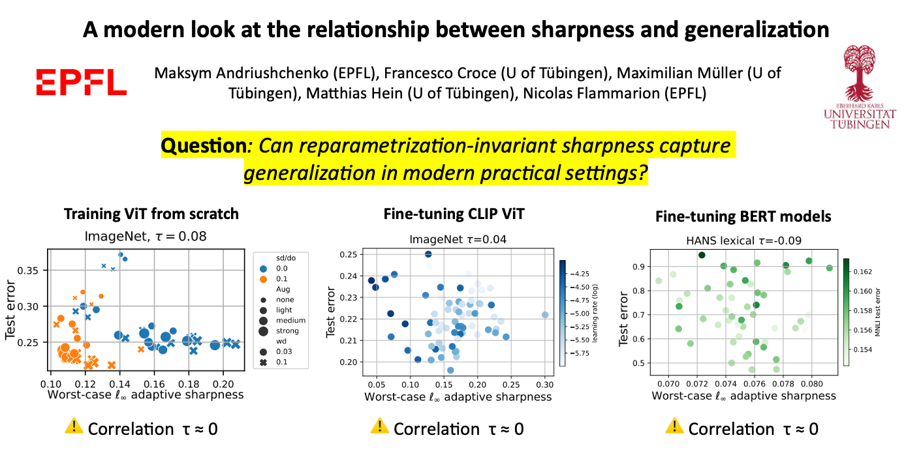

# A modern look at the relationship between sharpness and generalization

**Maksym Andriushchenko (EPFL), Francesco Croce (University of Tübingen), Maximilian Müller (University of Tübingen), Matthias Hein (University of Tübingen), Nicolas Flammarion (EPFL)**

**Paper:** [link](link)
<p align="center"></p>


## Scripts
The main script to evaluate sharpness is `eval_sharpness.py` for which you first need to install packages from `requirements.txt`. The command line parameters for `eval_sharpness.py` should be quite straightforward and their brief description is available in `help=...` of `parser.add_argument(...)`. For example, this script evaluates adaptive Linf worst-case sharpness (with logit normalization) and exports evaluation results in a json file:
```python
python eval_sharpness.py --dataset=cifar10 --model=vit_exp --model_width=512 --n_eval_sharpness=1024 --bs_sharpness=128 --rho=0.001 --adaptive --normalize_logits --n_iters=20 --algorithm=m_apgd_linf --log_folder=logs_final_vit_max_linf --model_path="${model_path}"
```
All CIFAR-10 evaluations can be reproduced by running `sh/eval_sharpness_final.sh`. The evaluations on ImageNet and BERT models can be run similarly but first one has to download the data and models (see below for the models).


## Models
- The models trained from scratch and fine-tuned on ImageNet from ImageNet-21k can be found here [https://github.com/google-research/vision_transformer#fine-tuning-a-model](https://github.com/google-research/vision_transformer#fine-tuning-a-model).
- The fine-tuned CLIP models can be found here [https://github.com/mlfoundations/model-soups/#step-1-downloading-the-models](https://github.com/mlfoundations/model-soups/#step-1-downloading-the-models).
- The fine-tuned BERT models can be found here [https://github.com/tommccoy1/hans](https://github.com/tommccoy1/hans).
- The CIFAR-10 Models that we trained can be found here [https://drive.google.com/drive/folders/1LmthJCb3RXBFWjeTOC4UOOl7Ppgg2h7n?usp=sharing](https://drive.google.com/drive/folders/1LmthJCb3RXBFWjeTOC4UOOl7Ppgg2h7n?usp=sharing). 


## Notebooks
- `notebooks/sharpness_deep_nets.ipynb`: plot various trends based on the results parsed from `eval_sharpness.py`.
- `notebooks/sharpness_linear_model.ipynb`: a quick plot for logistic regression showing the scale invariance issue (even for adaptive sharpness).

